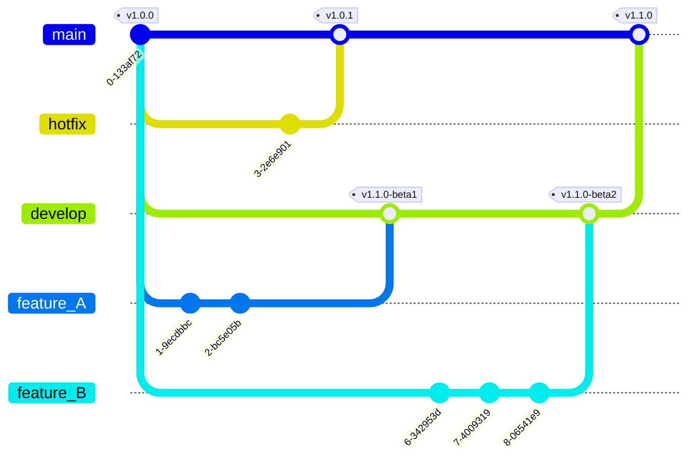

# Contributing to YaHud

This document describes the code style guidelines, branching strategy, pull request workflow, and release process for the YaHud project.

## 🎨 Code Style Guidelines

We follow [Microsoft's C# Coding Conventions](https://learn.microsoft.com/en-us/dotnet/csharp/fundamentals/coding-style/coding-conventions) with the following project-specific adjustments:

### Naming Conventions

| Element | Style | Example |
|---------|-------|---------|
| Private fields | camelCase (no underscore prefix) | `private int counter;` |
| Public properties | PascalCase | `public int Counter { get; set; }` |
| Methods | PascalCase | `public void CalculateScore()` |
| Local variables | camelCase | `var telemetryData = new();` |
| Constants | PascalCase | `public const int MaxRetries = 3;` |

### Field and Parameter Disambiguation

Since we don't use underscore prefixes for fields, use the `this` keyword when a method parameter has the same name as a field:

```csharp
public class TelemetryService
{
    private readonly ILogger logger;
    private int timeout;

    // ✅ Use 'this.' when parameter name matches field name
    public TelemetryService(ILogger logger, int timeout)
    {
        this.logger = logger;
        this.timeout = timeout;
    }

    // ✅ No 'this.' needed when names don't conflict
    public void UpdateTimeout(int newTimeout)
    {
        timeout = newTimeout;
    }
}
```

## 🏗️ Architecture Patterns

### Feature Service Architecture

YaHud uses a **layered architecture** with clear separation between data, services, and presentation:

```
┌─────────────────────────────────────────────────────────┐
│              Core Layer (R3E/Core)                      │
│  • ITelemetryService - Core telemetry events            │
│  • ITelemetryEventBus - Cross-feature mediator          │
│  • TelemetryData - Raw data wrapper                     │
└─────────────────────────────────────────────────────────┘
                         │
        ┌────────────────┴────────────────┐
        ▼                                 ▼
┌─────────────────────┐         ┌─────────────────────┐
│  Feature Services   │         │   Data Classes      │
│  (R3E/Features/*)   │         │   (R3E/Features/*)  │
│                     │         │                     │
│  • FuelService      │────────▶│  • FuelData         │
│  • SectorService    │────────▶│  • SectorData       │
│  • RadarService     │────────▶│  • RadarData        │
│                     │         │                     │
│  [Business Logic]   │         │  [Computed Props]   │
└─────────────────────┘         └─────────────────────┘
        │                                 ▲
        │                                 │
        └─────────────────┬───────────────┘
                          │
                          ▼
                ┌─────────────────────┐
                │   Widgets/UI        │
                │   (R3E.YaHud/       │
                │    Components)      │
                └─────────────────────┘
```

### Mediator Pattern (Event Bus)

To prevent circular dependencies between feature services, we use the **Mediator Pattern** via `ITelemetryEventBus`.

#### Architecture Diagram

```
                    ISharedSource
              (Memory-mapped file / UDP)
                         │
                         ▼
                  ITelemetryService
            (Detects & raises core events)
                    │         │
        ┌───────────┘         └───────────────┐
        ▼                                     ▼
  ITelemetryEventBus                  Core Events:
  (Cross-feature mediator)            - DataUpdated
        │                             - NewLap
        │                             - SessionTypeChanged
        │                             - SessionPhaseChanged
        │                             - CarPositionChanged
        │                             - TrackChanged
        │                             - CarChanged
        │                                     │
        ├──────────┬──────────┬───────────────┤
        ▼          ▼          ▼               ▼
   FuelService  SectorSvc  RadarSvc      FutureSvc
        │          │          │           (future)
        │          │          │               │
        │          │          │               │
    Publishes: Publishes: Subscribes:    Publishes:
        │    - Sector         │               │
        │      Completed      │               │
        │          │          │               │
        └──────────┴──────────┴───────────────┘
                         │
                         ▼
              Cross-Feature Events
            (via ITelemetryEventBus)
```

#### Why Use the Mediator Pattern?

**Problem Without Mediator:**

```csharp
// ❌ BAD: Circular dependency risk
public class FuelService
{
    public FuelService(SectorService sectorService)  // Depends on SectorService
    {
        sectorService.SectorCompleted += OnSectorCompleted;
    }
}

public class SectorService
{
    public SectorService(FuelService fuelService)  // Depends on FuelService
    {
        // Circular dependency! Won't compile!
    }
}
```

**Solution With Mediator:**

```csharp
// ✅ GOOD: No circular dependencies
public class FuelService
{
    public FuelService(ITelemetryEventBus eventBus)  // Only depends on interface
    {
        eventBus.SectorCompleted += OnSectorCompleted;  // Subscribe
    }
    
    private void OnNewLap()
    {
        eventBus.InvokeFuelLevelCritical(percentage);  // Raise
    }
}

public class SectorService
{
    public SectorService(ITelemetryEventBus eventBus)  // Only depends on interface
    {
        // No dependency on FuelService!
    }
    
    private void OnDataUpdated()
    {
        eventBus.InvokeSectorCompleted(Data, sectorIndex);  // Raise
    }
}
```

> **Naming convention:** the method that raises a cross-feature event is always
> prefixed `Invoke`, matching the event name — `SectorCompleted` is raised by
> `InvokeSectorCompleted`. `FuelLevelCritical` and `LapFuelUsageCalculated` above
> are illustrative; `SectorCompleted` is currently the only event on the bus.

### Feature Service Pattern

When creating a new feature, follow this structure:

```
R3E/Features/YourFeature/
├── YourFeatureData.cs          # Data class (computed properties only)
└── YourFeatureService.cs       # Service class (business logic)
```

#### 1. Data Class Pattern

**Purpose:** Hold data and provide computed properties. No business logic or service dependencies.

```csharp
// ✅ GOOD: Pure data class
public class FuelData
{
    private readonly TelemetryData telemetryData;
    private Shared Raw => telemetryData.Raw;

    internal FuelData(TelemetryData telemetryData)
    {
        this.telemetryData = telemetryData;
    }

    // Simple computed property - reads from Raw
    public double FuelLeft => Raw.FuelLeft <= 0 ? 0.0 : Raw.FuelLeft;
    
    // Mutable property updated by service
    public double LastLapFuelUsage { get; internal set; }
    
    // More computed properties...
}
```

**Data Class Rules:**
- ✅ Store reference to `TelemetryData` (not copies)
- ✅ Provide computed properties that read from `Raw`
- ✅ Allow service to update mutable fields (`internal set`)
- ❌ NO event subscriptions
- ❌ NO dependencies on other services
- ❌ NO complex business logic (>20 lines)
- ❌ NO `IDisposable` implementation

#### 2. Service Class Pattern

**Purpose:** Handle business logic, event subscriptions, and state management.

```csharp
// ✅ GOOD: Service with business logic
public class FuelService : IFuelService, IDisposable
{
    private readonly ITelemetryService telemetry;
    private readonly ITelemetryEventBus eventBus;
    private readonly ILogger<FuelService> logger;
    private readonly TelemetryData telemetryData;
    
    // State management
    private double oldFuelRemaining;
    
    // Single data instance - never recreated
    public FuelData Data { get; }
    
    public FuelService(
        ITelemetryService telemetry,
        ITelemetryEventBus eventBus,
        ILogger<FuelService> logger)
    {
        this.telemetry = telemetry;
        this.eventBus = eventBus;
        this.logger = logger;
        
        // Store reference once
        telemetryData = telemetry.Data;
        Data = new FuelData(telemetryData);
        
        // Subscribe to events
        telemetry.NewLap += OnNewLap;
        telemetry.SessionPhaseChanged += OnSessionPhaseChanged;
    }
    
    private void OnNewLap(TelemetryData data)
    {
        var currentFuel = telemetryData.Raw.FuelLeft;
        var fuelUsed = oldFuelRemaining - currentFuel;
        
        // Update mutable data field
        Data.LastLapFuelUsage = fuelUsed;
        
        oldFuelRemaining = currentFuel;
        
        // Raise cross-feature event
        eventBus.InvokeLapFuelUsageCalculated(fuelUsed);
        
        // Check for critical condition
        if (Data.FuelRemainingPercentage < 10.0)
        {
            eventBus.InvokeFuelLevelCritical(Data.FuelRemainingPercentage);
        }
    }
    
    public void Dispose()
    {
        telemetry.NewLap -= OnNewLap;
        telemetry.SessionPhaseChanged -= OnSessionPhaseChanged;
        GC.SuppressFinalize(this);
    }
}
```

**Service Class Rules:**
- ✅ Depend on `ITelemetryService` and `ITelemetryEventBus`
- ✅ Subscribe to events in constructor
- ✅ Create data class instance **once** (store reference)
- ✅ Update only mutable data fields (not entire object)
- ✅ Publish cross-feature events via `ITelemetryEventBus`
- ✅ Implement `IDisposable` to unsubscribe from events
- ❌ NO recreating data instances on every update (@60Hz!)
- ❌ NO direct dependencies on other feature services

### When to Move Logic from Data to Service

| Move to Service When: | Keep in Data When: |
|------------------------|-------------------|
| Method > 20 lines | Simple property getter |
| Depends on other services | Only uses raw telemetry |
| Performs filtering/sorting | Basic arithmetic |
| Has business rules | Direct field access |
| Maintains state history | No dependencies |

### Cross-Feature Communication

#### Core Events (from ITelemetryService)

Use for session lifecycle events:
- `DataUpdated` - Telemetry data refreshed (@60Hz)
- `NewLap` - Lap completed
- `SessionTypeChanged` - Session type changed
- `SessionPhaseChanged` - Session phase changed (Countdown, Formation, Green, etc.)
- `CarPositionChanged` - Player position changed
- `TrackChanged` - Track changed
- `CarChanged` - Car changed

#### Cross-Feature Events (via ITelemetryEventBus)

Use for domain-specific communication between features:

**Current Events:**

- `SectorCompleted(SectorData sectorData, int sectorIndex)` - Sector completed
  (raised via `InvokeSectorCompleted(sectorData, sectorIndex)`)

**Adding New Cross-Feature Events:**

1. **Add to `ITelemetryEventBus.cs`:**

```csharp
public interface ITelemetryEventBus
{
    // Your new event
    event Action<int, TimeSpan>? LapTimeImproved;
    void InvokeLapTimeImproved(int lapNumber, TimeSpan lapTime);
}
```

2. **Implement in `TelemetryEventBus.cs`:**

```csharp
public class TelemetryEventBus : ITelemetryEventBus
{
    public event Action<int, TimeSpan>? LapTimeImproved;
    
    public void InvokeLapTimeImproved(int lapNumber, TimeSpan lapTime)
        => LapTimeImproved?.Invoke(lapNumber, lapTime);
}
```

3. **Publish from any service:**

```csharp
public class LapTimeService
{
    private void OnNewLap()
    {
        if (currentLapTime < bestLapTime)
        {
            eventBus.InvokeLapTimeImproved(lapNumber, currentLapTime);
        }
    }
}
```

4. **Subscribe from any service:**

```csharp
public class NotificationService
{
    public NotificationService(ITelemetryEventBus eventBus)
    {
        eventBus.LapTimeImproved += OnLapTimeImproved;
    }
    
    private void OnLapTimeImproved(int lapNumber, TimeSpan lapTime)
    {
        ShowNotification($"Lap {lapNumber}: {lapTime:mm\\:ss\\.fff}");
    }
}
```

### Dependency Injection Registration

Register services in `Program.cs`:

```csharp
// Core services
builder.Services.AddSingleton<ITelemetryEventBus, TelemetryEventBus>();
builder.Services.AddSingleton<ITelemetryService, TelemetryService>();

// Feature services - order doesn't matter!
builder.Services.AddSingleton<FuelService>();
builder.Services.AddSingleton<SectorService>();
builder.Services.AddSingleton<DriverService>();
builder.Services.AddSingleton<ITimeGapService, SimpleTimeGapService>();
```

**Notes:**
- Use `AddSingleton` for services (shared across application lifetime)
- Order of feature service registration doesn't matter (no dependencies!)
- Always register via interface when available

### Performance Considerations

#### DO NOT Recreate Data Instances

```csharp
// ❌ BAD: Creates new object every 16ms (@60Hz)
private void OnDataUpdated(TelemetryData data)
{
    Data = new FuelData(telemetryData);  // Wasteful allocation!
}

// ✅ GOOD: Reuse same instance, update only what changed
private void OnNewLap(TelemetryData data)
{
    Data.LastLapFuelUsage = fuelUsed;  // Update single field
}
```

#### Computed Properties Read Directly from Raw

```csharp
public class FuelData
{
    private Shared Raw => telemetryData.Raw;
    
    // ✅ Computed on-demand from current Raw data
    public double FuelLeft => Raw.FuelLeft <= 0 ? 0.0 : Raw.FuelLeft;
}
```

**Benefits:**
- ✅ No allocations @ 60Hz
- ✅ Minimal GC pressure
- ✅ Cache-friendly (same instance)
- ✅ Always reflects current data

## 🌳 Branching Strategy

We use **GitFlow** with automated versioning via GitVersion. All version numbers are calculated automatically based on branch names and Git history.

### Branch Types

| Branch Type | Pattern | Purpose | Version Example |
|------------|---------|---------|-----------------|
| `main` | `main` | Production releases | `1.0.0` |
| `develop` | `develop` | Integration/staging branch | `1.1.0-beta.1` |
| `feature/*` | `feature/name` or `features/name` | New features or improvements | `1.1.0-alpha.1` |
| `hotfix/*` | `hotfix/name` or `hotfixes/name` | Critical production bug fixes | `1.0.1` |

### Branch Naming Examples

✅ **Good:**
- `feature/add-telemetry`
- `feature/widget/radar`
- `features/improve-ui`
- `hotfix/fix-crash`
- `hotfix/memory-leak`

❌ **Bad:**
- `my-feature` (missing prefix)
- `feat/new-thing` (wrong prefix)
- `feature_name` (use `/` or `-`, not `_`)

## 🔄 Workflow Patterns

### Adding a New Feature

```
1. Create feature branch from develop
   git checkout develop
   git pull origin develop
   git checkout -b feature/my-feature

2. Make your changes and commit
   git add .
   git commit -m "Add my feature"
   git push origin feature/my-feature

3. Create PR to develop
   - PR Build Validation will run
   - Request review from team members

4. After approval, merge to develop
   - Creates beta version (e.g., 1.1.0-beta.1)

5. When ready for release, create PR from develop to main
   - Version Preview will show final release version
   - Build Validation will run

6. Merge to main
   - Automatically creates GitHub release
   - Builds and publishes artifacts
```

### Hotfix for Production

```
1. Create hotfix branch from main
   git checkout main
   git pull origin main
   git checkout -b hotfix/fix-critical-bug

2. Make your fix and commit
   git add .
   git commit -m "Fix critical bug"
   git push origin hotfix/fix-critical-bug

3. Create PR to main
   - Version Preview shows patch version (e.g., 1.0.1)
   - Build Validation runs

4. Merge to main
   - Automatically creates hotfix release
   - Increments patch version only

5. Back-merge to develop
   git checkout develop
   git merge main
   git push origin develop
```

## 📦 Release Process

Releases are **fully automated** when PRs are merged to `main`.

### What Happens on Merge to Main

1. **Version Calculation** - GitVersion determines the version number
2. **Build** - All projects are built for Windows and Linux
3. **Package** - Creates ZIP archives of the artifacts
4. **Release** - Creates GitHub release with:
   - Auto-generated release notes
   - Tagged version (e.g., `v1.0.0`)
   - Build artifacts attached

### Artifacts Published

Each release includes:
- `R3E.Relay-win-x64-v{version}.zip` - Windows relay service
- `R3E.YaHud-win-x64-v{version}.zip` - Windows HUD application
- `R3E.YaHud-linux-x64-v{version}.zip` - Linux HUD application

## 🏷️ Version Numbering

Versions follow [Semantic Versioning 2.0.0](https://semver.org/): `MAJOR.MINOR.PATCH`

### Automatic Increment Rules

| Action | Version Change | Example |
|--------|---------------|---------|
| Merge feature to develop | Minor + beta tag | `1.0.0` → `1.1.0-beta.1` |
| Merge develop to main | Minor (stable) | `1.0.0` → `1.1.0` |
| Merge hotfix to main | Patch | `1.0.0` → `1.0.1` |

### Version Tags by Branch

- **`main`**: No pre-release tag (stable: `1.0.0`)
- **`develop`**: Beta tag (`1.1.0-beta.1`)
- **`feature/*`**: Alpha tag (`1.1.0-alpha.1`)
- **`hotfix/*`**: No pre-release tag (`1.0.1`)

## 🛡️ Branch Protection Rules

Protection is configured with **repository rulesets**, not classic branch
protection. Neither ruleset defines bypass actors, so the rules apply to
maintainers as well.

### Main Branch

- ✅ Block branch deletion
- ✅ Block force pushes (non-fast-forward)

### Develop Branch

- ✅ Block branch deletion
- ✅ Block force pushes (non-fast-forward)
- ✅ Require a pull request before merging, with:
  - 1 approving review
  - All review conversations resolved
  - Merge, squash and rebase all permitted

### Not currently enforced

The following are **not** configured, so don't rely on them:

- **No required status checks on either branch.** `PR Validation` runs on every
  PR, but a failing build does not block merging — check the result yourself
  before merging.
- **No PR requirement on `main`.** Direct pushes to `main` are possible, and a
  push to `main` triggers a release build.
- **No source-branch restrictions.** The GitFlow rules in
  [Workflow Patterns](#-workflow-patterns) are convention, not enforcement.
- **No linear-history or up-to-date-branch requirement.**

## GitFlow Diagram

Below is a `gitGraph` diagram that visualizes the branching and release flow used in this repository.


```mermaid
gitGraph
 commit tag:"v1.0.0"
 branch hotfix
 branch develop
 branch feature_A
 branch feature_B
 checkout feature_A
 commit
 commit
 checkout hotfix
 commit
 checkout main
 merge hotfix tag:"v1.0.1"
 checkout develop
 merge feature_A tag:"v1.1.0-beta1"
 checkout feature_B
 commit
 commit
 commit
 checkout develop
 merge feature_B tag:"v1.1.0-beta2"
 checkout main
 merge develop tag:"v1.1.0"
```

## 🤖 GitHub Actions Workflows

### 1. PR Build Validation (`pr-build.yml`)
- **Triggers:** PRs to `main` or `develop`
- **Purpose:** Validate code compiles successfully
- **Runs:** Full solution build

### 2. PR Version Preview (`pr-version-preview.yml`)
- **Triggers:** PRs to `main` only
- **Purpose:** Show what version will be released
- **Posts:** Comment on PR with version details

### 3. Build and Release (`build-release.yml`)
- **Triggers:** Push to `main` (after PR merge)
- **Purpose:** Create production release
- **Produces:** GitHub release with artifacts

## 🏷️ Pull Request Labels

Every PR should carry at least one **type** label. Labels are not decorative —
[`.github/release.yml`](.github/release.yml) uses them to group the
auto-generated release notes, so an unlabelled PR ends up under *Other Changes*.

### Type labels (pick one)

| Label | Use for |
|-------|---------|
| `enhancement` | New user-facing functionality |
| `widget` | New HUD widget, or changes to an existing one (usually with `enhancement`) |
| `bug` | Fixing broken behaviour |
| `documentation` | README, CONTRIBUTING, or `docs/` changes |
| `refactor` | Restructuring working code with no behaviour change |
| `chore` | Housekeeping: cleanup, tooling, config, dead-code removal |
| `ci` | GitHub Actions workflows, build, or versioning setup |
| `packaging` | Distribution: AppImage, archives, release artifacts |
| `dependencies` | Dependency bumps (Dependabot applies this automatically) |
| `.NET` | Runtime, SDK, or target framework upgrades |
| `release` | The `develop` → `main` release PR (excluded from release notes) |

`chore` vs `refactor`: if you moved or rewrote production code, it's `refactor`;
if you deleted something unused or touched only tooling and config, it's `chore`.

### Platform labels (add when relevant)

`linux` and `windows` mark changes that only affect one platform — for example
the D-Bus tray code or the WinForms `NotifyIcon`. Add them alongside a type
label, never instead of one.

### Ordering caveat

Release-note categories are matched top to bottom and **the first match wins**.
A PR labelled both `documentation` and `packaging` appears under Documentation.
If you add or reorder labels, update `.github/release.yml` to match.

## 📝 Commit Message Guidelines

While not enforced, we recommend clear commit messages:

```
# Good examples
Add radar widget to HUD
Fix crash when loading telemetry data
Update dependencies to latest versions
Refactor telemetry service for better performance

# Include more details in body if needed
Fix memory leak in telemetry processor

The telemetry processor was not properly disposing of
resources, causing memory to accumulate over time.
This fix ensures proper cleanup after each processing cycle.
```

## 🚀 Quick Reference

```bash
# Start new feature
git checkout develop
git pull origin develop
git checkout -b feature/your-feature

# Start hotfix/bugfix
git checkout main
git pull origin main
git checkout -b hotfix/your-fix

# Check what version would be generated
dotnet-gitversion

# Push and create PR on GitHub
git push origin <branch-name>
# Then create PR via GitHub web interface
```

## ❓ FAQ

**Q: Why don't we use underscore prefixes for private fields?**  
A: We follow a simplified version of Microsoft's conventions. Use `this.` when parameter names match field names to avoid ambiguity.

**Q: Can I merge feature branches directly to main?**  
A: No. Features must go through `develop` first, then `develop` → `main`.

**Q: What if I need to make a quick fix to a feature in develop?**  
A: Create a new feature branch from develop, make your fix, and PR back to develop.

**Q: Can I manually set the version number?**  
A: No. Versions are calculated by GitVersion based on Git history and tags. To set an initial version, create a Git tag.

**Q: What happens if I name my branch incorrectly?**  
A: GitVersion won't recognize it and will use default versioning. Always use the correct prefixes: `feature/`, `hotfix/`.

**Q: Should I create a new data instance on every telemetry update?**  
A: No! Create data instances **once** and reuse them. Only update mutable fields as needed. Recreating objects @ 60Hz causes excessive GC pressure.

**Q: When should I add a new event to ITelemetryEventBus?**  
A: When you need cross-feature communication. If it's core telemetry lifecycle (lap, session), use `ITelemetryService` events instead.

**Q: Can a feature service depend on another feature service?**  
A: No. Use `ITelemetryEventBus` for cross-feature communication to avoid circular dependencies.

---

For questions or issues with this process, please open an issue, start a discussion or contact the maintainers.
