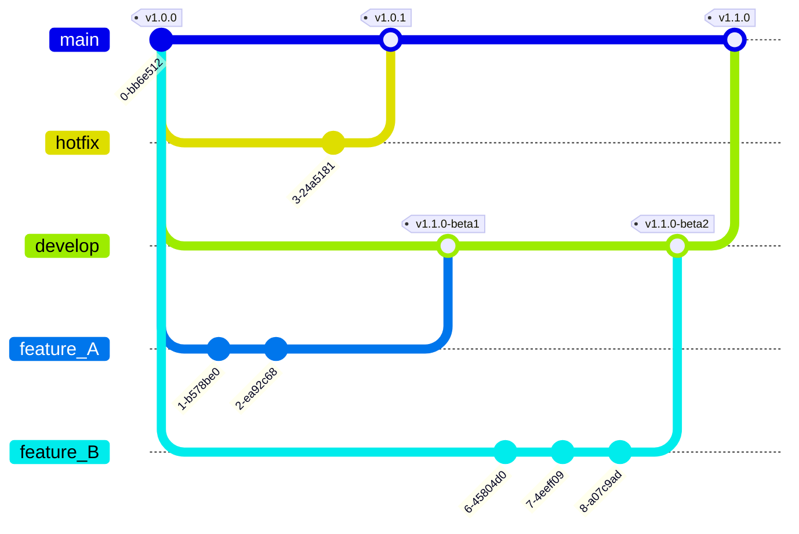

# Contributing to YaHud

This document describes the code style guidelines, branching strategy, pull request workflow, and release process for the YaHud project.

## 🎨 Code Style Guidelines

We follow [Microsoft's C# Coding Conventions](https://learn.microsoft.com/en-us/dotnet/csharp/fundamentals/coding-style/coding-conventions) with the following project-specific adjustments:

### Naming Conventions

| Element | Style | Example |
|---------|-------|---------|
| Private fields | camelCase (no underscore prefix) | `private int counter;` |
| Public properties | PascalCase | `public int Counter { get; set; }` |
| Methods | PascalCase | `public void CalculateScore()` |
| Local variables | camelCase | `var telemetryData = new();` |
| Constants | PascalCase | `public const int MaxRetries = 3;` |

### Field and Parameter Disambiguation

Since we don't use underscore prefixes for fields, use the `this` keyword when a method parameter has the same name as a field:

```csharp
public class TelemetryService
{
    private readonly ILogger logger;
    private int timeout;

    // ✅ Use 'this.' when parameter name matches field name
    public TelemetryService(ILogger logger, int timeout)
    {
        this.logger = logger;
        this.timeout = timeout;
    }

    // ✅ No 'this.' needed when names don't conflict
    public void UpdateTimeout(int newTimeout)
    {
        timeout = newTimeout;
    }
}
```

## 🌳 Branching Strategy

We use **GitFlow** with automated versioning via GitVersion. All version numbers are calculated automatically based on branch names and Git history.

### Branch Types

| Branch Type | Pattern | Purpose | Version Example |
|------------|---------|---------|-----------------|
| `main` | `main` | Production releases | `1.0.0` |
| `develop` | `develop` | Integration/staging branch | `1.1.0-beta.1` |
| `feature/*` | `feature/name` or `features/name` | New features or improvements | `1.1.0-alpha.1` |
| `hotfix/*` | `hotfix/name` or `hotfixes/name` | Critical production bug fixes | `1.0.1` |

### Branch Naming Examples

✅ **Good:**
- `feature/add-telemetry`
- `feature/widget/radar`
- `features/improve-ui`
- `hotfix/fix-crash`
- `hotfix/memory-leak`

❌ **Bad:**
- `my-feature` (missing prefix)
- `feat/new-thing` (wrong prefix)
- `feature_name` (use `/` or `-`, not `_`)

## 🔄 Workflow Patterns

### Adding a New Feature

```
1. Create feature branch from develop
   git checkout develop
   git pull origin develop
   git checkout -b feature/my-feature

2. Make your changes and commit
   git add .
   git commit -m "Add my feature"
   git push origin feature/my-feature

3. Create PR to develop
   - PR Build Validation will run
   - Request review from team members

4. After approval, merge to develop
   - Creates beta version (e.g., 1.1.0-beta.1)

5. When ready for release, create PR from develop to main
   - Version Preview will show final release version
   - Build Validation will run

6. Merge to main
   - Automatically creates GitHub release
   - Builds and publishes artifacts
```

### Hotfix for Production

```
1. Create hotfix branch from main
   git checkout main
   git pull origin main
   git checkout -b hotfix/fix-critical-bug

2. Make your fix and commit
   git add .
   git commit -m "Fix critical bug"
   git push origin hotfix/fix-critical-bug

3. Create PR to main
   - Version Preview shows patch version (e.g., 1.0.1)
   - Build Validation runs

4. Merge to main
   - Automatically creates hotfix release
   - Increments patch version only

5. Back-merge to develop
   git checkout develop
   git merge main
   git push origin develop
```

## 📦 Release Process

Releases are **fully automated** when PRs are merged to `main`.

### What Happens on Merge to Main

1. **Version Calculation** - GitVersion determines the version number
2. **Build** - All projects are built for Windows and Linux
3. **Package** - Creates ZIP archives of the artifacts
4. **Release** - Creates GitHub release with:
   - Auto-generated release notes
   - Tagged version (e.g., `v1.0.0`)
   - Build artifacts attached

### Artifacts Published

Each release includes:
- `R3E.Relay-win-x64-v{version}.zip` - Windows relay service
- `R3E.YaHud-win-x64-v{version}.zip` - Windows HUD application
- `R3E.YaHud-linux-x64-v{version}.zip` - Linux HUD application

## 🏷️ Version Numbering

Versions follow [Semantic Versioning 2.0.0](https://semver.org/): `MAJOR.MINOR.PATCH`

### Automatic Increment Rules

| Action | Version Change | Example |
|--------|---------------|---------|
| Merge feature to develop | Minor + beta tag | `1.0.0` → `1.1.0-beta.1` |
| Merge develop to main | Minor (stable) | `1.0.0` → `1.1.0` |
| Merge hotfix to main | Patch | `1.0.0` → `1.0.1` |

### Version Tags by Branch

- **`main`**: No pre-release tag (stable: `1.0.0`)
- **`develop`**: Beta tag (`1.1.0-beta.1`)
- **`feature/*`**: Alpha tag (`1.1.0-alpha.1`)
- **`hotfix/*`**: No pre-release tag (`1.0.1`)

## 🛡️ Branch Protection Rules

### Main Branch

- ✅ Require pull request before merging
- ✅ Require 1+ approvals
- ✅ Require status checks to pass:
  - `validate` (build validation)
  - `version-preview` (version calculation)
- ✅ Only allow PRs from:
  - `develop` branch
  - `hotfix/*` branches
- ✅ Require branches to be up to date

### Develop Branch

- ✅ Require pull request before merging
- ✅ Require status checks to pass:
  - `validate` (build validation)
- ✅ Only allow PRs from:
  - `feature/*` branches

## GitFlow Diagram

Below is a `gitGraph` diagram that visualizes the branching and release flow used in this repository.



## 🤖 GitHub Actions Workflows

### 1. PR Build Validation (`pr-build.yml`)
- **Triggers:** PRs to `main` or `develop`
- **Purpose:** Validate code compiles successfully
- **Runs:** Full solution build

### 2. PR Version Preview (`pr-version-preview.yml`)
- **Triggers:** PRs to `main` only
- **Purpose:** Show what version will be released
- **Posts:** Comment on PR with version details

### 3. Build and Release (`build-release.yml`)
- **Triggers:** Push to `main` (after PR merge)
- **Purpose:** Create production release
- **Produces:** GitHub release with artifacts

## 📝 Commit Message Guidelines

While not enforced, we recommend clear commit messages:

```
# Good examples
Add radar widget to HUD
Fix crash when loading telemetry data
Update dependencies to latest versions
Refactor telemetry service for better performance

# Include more details in body if needed
Fix memory leak in telemetry processor

The telemetry processor was not properly disposing of
resources, causing memory to accumulate over time.
This fix ensures proper cleanup after each processing cycle.
```

## 🚀 Quick Reference

```bash
# Start new feature
git checkout develop
git pull origin develop
git checkout -b feature/your-feature

# Start hotfix/bugfix
git checkout main
git pull origin main
git checkout -b hotfix/your-fix

# Check what version would be generated
dotnet-gitversion

# Push and create PR on GitHub
git push origin <branch-name>
# Then create PR via GitHub web interface
```

## ❓ FAQ

**Q: Why don't we use underscore prefixes for private fields?**  
A: We follow a simplified version of Microsoft's conventions. Use `this.` when parameter names match field names to avoid ambiguity.

**Q: Can I merge feature branches directly to main?**  
A: No. Features must go through `develop` first, then `develop` → `main`.

**Q: What if I need to make a quick fix to a feature in develop?**  
A: Create a new feature branch from develop, make your fix, and PR back to develop.

**Q: Can I manually set the version number?**  
A: No. Versions are calculated by GitVersion based on Git history and tags. To set an initial version, create a Git tag.

**Q: What happens if I name my branch incorrectly?**  
A: GitVersion won't recognize it and will use default versioning. Always use the correct prefixes: `feature/`, `hotfix/`.

---

For questions or issues with this process, please open an issue or contact the maintainers.
