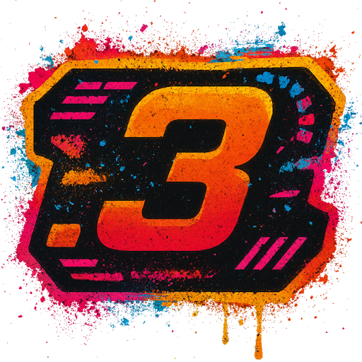

# YaHud - Yet Another HUD for RaceRoom Racing Experience

A modern, customizable HUD (Heads-Up Display) overlay for RaceRoom Racing Experience, built with Blazor and .NET 10.



## 🎮 Features

- **Cross-Platform Support**: Native Windows support with Linux compatibility via relay service
- **Customizable Widgets**: Drag-and-drop widget positioning with persistent settings
- **Real-Time Telemetry**: Live data from RaceRoom's shared memory API
- **Modern UI**: Clean, responsive interface built with Blazor
- **Multiple Widgets**: Clock, MoTec-style display, user inputs, and more (with more coming!)
- **Settings Panel**: Comprehensive configuration interface for all widgets
- **Locked/Unlocked Modes**: Lock HUD to prevent accidental repositioning during races

## 📋 Current Widgets

- **Clock**: Display current time
- **MoTec**: Racing telemetry display
- **User Inputs**: Visualize throttle, brake, and clutch inputs
- *(More widgets planned for future releases)*

## 🚀 Getting Started

### Prerequisites

- [.NET 10.0 Runtime](https://dotnet.microsoft.com/download/dotnet/10.0) (or .NET 10.0 ASP.NET Core Runtime for server components)
- RaceRoom Racing Experience
- Windows (for native support) or Linux (with relay service)

### Installation

1. Download the latest release from the [Releases](../../releases) page

   - `R3E.YaHud-win-x64-v{version}.zip` - HUD application for Windows
   - `R3E.YaHud-linux-x64-v{version}.zip` - HUD application for Linux
   - `R3E.Relay-win-x64-v{version}.zip` - Relay service (required for Linux support)

2. Extract the files to your preferred location

### Configuration

Add the following launch option to RaceRoom (required for all platforms):

```
-webHudUrl=http://localhost:5019/
```

To add launch options in Steam:

1. Right-click RaceRoom Racing Experience in your library
2. Select "Properties"
3. In the "General" tab, add the launch option to the "Launch Options" field

#### Windows (Native)

Simply run the executable:

```bash
YaHud.exe
```

The HUD will automatically connect to RaceRoom's shared memory.

#### Linux (via Relay) 
---

Before the HUD will work you will need to install the following:

   - `.NET 10` - For the HUD application dependency
   - `GTK libraries` - For the tray application on Linux

### Only for Debian / Ubuntu / Linux Mint based distoes:

```bash
# 1. Add Microsoft package repository
wget https://packages.microsoft.com/config/ubuntu/24.04/packages-microsoft-prod.deb
sudo dpkg -i packages-microsoft-prod.deb
sudo apt update

# 2. Install .NET 10 SDK
sudo apt install dotnet-sdk-10.0

# 3. Verify that .NET has been installed correct
dotnet --version

# 4. Install GTK 3 libraries
sudo apt install libgtk-3-dev
```

---
### Only for Fedora / RHEL / CentOS based distoes:
```bash
# 1. Install .NET 10 SDK
sudo dnf install dotnet-sdk-10.0

# 2. Verify that .NET has been installed correct
dotnet --version

# 3. Install GTK 3 libraries
sudo dnf install gtk3-devel
```

---
### Only for Arch Linux / Manjaro based distoes:
```bash
# 1. Install .NET 10 SDK (runtime included)
sudo pacman -S dotnet-sdk

# 2. Verify that .NET has been installed correct
dotnet --version

# 3. Install GTK 3 libraries
sudo pacman -S gtk3
```
---

For Linux support, you need to run the relay service inside the same Proton instance as RaceRoom:

1. Extract `R3E.Relay-win-x64-v{version}.zip` (e.g., `R3E.Relay-win-x64-v1.0.0.zip`) to a location accessible from your Steam Proton prefix. <br>
   An example for a path: `/.steam/steam/steamapps/compatdata/211500/pfx/drive_c/Program Files/R3ERelay` so it is already located inside your proton env.

2. Start the relay service in the Proton environment using the `Terminal` command:

```bash
# Replace STEAM_COMPAT_CLIENT_INSTALL_PATH with your Linux user's name. Steam should be installed there unless you have chosen another place.
# Replace the path to match where you extracted R3ERelay. If placed inside steams proton env you can use the Program Files path.
STEAM_COMPAT_CLIENT_INSTALL_PATH="/$HOME/.local/share/Steam" \
STEAM_COMPAT_DATA_PATH="/$HOME/.local/share/Steam/steamapps/compatdata/211500" \
"/$HOME/.local/share/Steam/compatibilitytools.d/GE-Proton10-4/proton" run \
"C:\Program Files\R3ERelay\R3ERelay.exe"
```

> **Note**: Adjust the Proton version (e.g., `GE-Proton10-4`) to match the version you're using for RaceRoom.

3. On your Linux machine download `R3E.YaHud-linux-x64-v{version}.zip` from the release page. <br>
Extract the zip somewhere, and change directory in your `terminal` to the folder, you have extracted the HUD application. <br>
To run the HUD application run the following command in the terminal:
```bash
./YaHud
```

The relay service forwards RaceRoom's shared memory data over UDP, allowing the HUD to run natively on Linux.

> **Tip**: You can create a shell script to automate starting the relay service with the correct Proton environment.

## 🎯 Usage

### Keyboard Shortcuts

- **Alt + Shift + Ctrl + L**: Toggle Lock/Unlock mode
- **Unlocked**: Widgets can be dragged and repositioned, settings icon is visible
- **Locked**: HUD is locked in place for racing (default)

### Settings Panel

When unlocked, click the ⚙️ (gear) icon to open the settings panel where you can:

- Configure individual widget settings
- Show/hide widgets
- Reset widget positions
- Adjust display preferences
- Clear all settings (Expert mode)

### About Panel

Click the ℹ️ (info) icon to view credits and third-party licenses.

## 🏗️ Architecture

The project consists of three main components:

### R3E.YaHud
The main Blazor web application that renders the HUD overlay.

### R3E
Core library containing:

- RaceRoom shared memory API definitions
- Telemetry data processing
- Cross-platform data source interfaces
- Unit converters (speed, temperature, angular velocity)

### R3E.Relay
Windows service that forwards RaceRoom shared memory data via UDP for cross-platform support.

## 🛠️ Development

### Building from Source

```bash
# Clone the repository
git clone https://github.com/SCarlsen7757/YaHud.git
cd YaHud

# Build the solution
dotnet build

# Run the HUD
cd R3E.YaHud
dotnet run
```

### Versioning

This project uses [GitVersion](https://gitversion.net/) for automatic semantic versioning based on Git history. The version is automatically calculated from:

- Git tags
- Branch names
- Commit messages

GitVersion.MsBuild is integrated into all projects and automatically sets assembly versions during build without manual intervention.

### Publishing for Distribution

To create release builds:

```bash
# Build YaHud for Windows
dotnet publish R3E.YaHud/R3E.YaHud.csproj -c Release -r win-x64 --self-contained true -p:PublishSingleFile=true

# Build YaHud for Linux
dotnet publish R3E.YaHud/R3E.YaHud.csproj -c Release -r linux-x64 --self-contained true -p:PublishSingleFile=true

# Build Relay service (Windows only, runs in Proton on Linux)
dotnet publish R3E.Relay/R3E.Relay.csproj -c Release -r win-x64 --self-contained true -p:PublishSingleFile=true
```

**Note:** Versions are automatically injected by GitVersion.MsBuild during the build process.

### Project Structure

```
R3E/
├── R3E.YaHud/              # Main Blazor HUD application
│   ├── Components/
│   │   ├── Pages/          # Blazor pages
│   │   ├── UI/             # UI components
│   │   └── Widget/         # HUD widgets
│   ├── Services/           # Application services
│   └── wwwroot/            # Static assets
├── R3E/                    # Core library
│   └── API/                # RaceRoom API and telemetry
├── R3E.Relay/              # UDP relay service
└── R3E.Tray/               # Tray service
    ├── Assets              # Contains icon for tray service
    ├── Linux               # GTK code for tray Applet for Linux
    └── Windows             # Windows Forms code for tray app for Windows
```

### Creating Custom Widgets

Widgets inherit from `HudWidgetBase<TSettings>` and implement:

- Position management
- Settings persistence
- Telemetry data updates
- Custom rendering

Example:

```csharp
@using R3E.YaHud.Components.Widget.Core
@inherits HudWidgetBase<ExampleSettings>
@implements IDisposable

<WidgetHost Owner="this">
    <div class="example-widget">
        <p>Widget Content</p>
    </div>
</WidgetHost>

@code {
    public override string ElementId { get => "exampleWidget"; }
    public override string Name => "Example";
    public override string Category => "ExampleCategory";

    // Default placement on screen in %
    public override double DefaultXPercent => 50;
    public override double DefaultYPercent => 20;

    //Optional
    public override bool Collidable => false;
    protected override bool UseR3EData => false;

    protected override void OnInitialized()
    {
        base.OnInitialized();
        // OBS. Can't use settings here
    }

    protected override Task OnSettingsLoadedAsync()
    {
        // Read default settings here into widget
    }

    protected override void Update()
    {
        // Access data using injected services
    }

    protected override void UpdateWithTestData()
    {
        // Update with test values to display state of widget
    }

    public override void Dispose()
    {
        base.Dispose();
    }
}
```

## 📦 Dependencies

### Main Application

- ASP.NET Core Blazor Server
- Bootstrap 5
- Font Awesome (icons)
- Coloris (color picker)
- GTK Libraries (Linux icon applet)

### Platform Support

- Windows: Memory-mapped file access to RaceRoom shared memory
- Linux: UDP receiver for relay service data

## 🙏 Credits

- **Blazor** — Powered by [Microsoft Blazor](https://dotnet.microsoft.com/apps/aspnet/web-apps/blazor)
- **Font Awesome Free** — Icons by [Font Awesome](https://fontawesome.com), used under the [CC BY 4.0 License](https://creativecommons.org/licenses/by/4.0/)
- **Coloris** — Color picker by [Coloris](https://coloris.js.org/), used under the [MIT License](https://github.com/mdbassit/Coloris/blob/main/LICENSE)

## 📄 License

This project is licensed under the GNU General Public License v3.0 - see the [LICENSE](LICENSE) file for details.

## 🤝 Contributing

Contributions are welcome! Please feel free to submit a Pull Request.

1. Fork the project
2. Create your feature branch (`git checkout -b feature/AmazingFeature`)
3. Commit your changes (`git commit -m 'Add some AmazingFeature'`)
4. Push to the branch (`git push origin feature/AmazingFeature`)
5. Open a Pull Request

## 🐛 Known Issues

- Widgets are still in development
- Linux support requires running the relay service on Windows

## 📮 Support

If you encounter any issues or have questions, please [open an issue](../../issues) on GitHub.

## ⚡ Performance Notes

The HUD updates at approximately 60Hz (16ms intervals) when receiving telemetry data. When the game is paused, the update rate is reduced to conserve resources.

---

**Note**: This is an unofficial third-party tool and is not affiliated with or endorsed by Sector3 Studios or RaceRoom Racing Experience.
