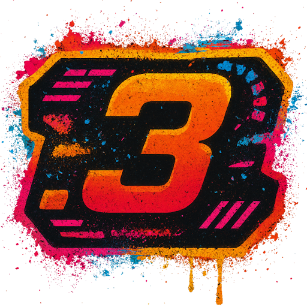

# YaHud - Yet Another HUD for RaceRoom Racing Experience

A modern, customizable HUD (Heads-Up Display) overlay for RaceRoom Racing Experience, built with Blazor and .NET 10.



## 🎮 Features

- **Cross-Platform Support**: Native Windows support with Linux compatibility via relay service
- **Customizable Widgets**: Drag-and-drop widget positioning with persistent settings
- **Real-Time Telemetry**: Live data from RaceRoom's shared memory API
- **Record & Replay**: Capture telemetry to a file and replay it through the HUD with the game closed
- **Modern UI**: Clean, responsive interface built with Blazor
- **Multiple Widgets**: Clock, MoTec-style display, user inputs, and more (with more coming!)
- **Settings Panel**: Comprehensive configuration interface for all widgets
- **Locked/Unlocked Modes**: Lock HUD to prevent accidental repositioning during races

## 📋 Current Widgets

- **Clock**: Display current time
- **MoTec**: Racing telemetry display
- **User Inputs**: Visualize throttle, brake, and clutch inputs
- *(More widgets planned for future releases)*

## 🚀 Getting Started

### Prerequisites

- [.NET 10.0 Runtime](https://dotnet.microsoft.com/download/dotnet/10.0) (or .NET 10.0 ASP.NET Core Runtime for server components)
- RaceRoom Racing Experience
- Windows (for native support) or Linux (with relay service)

### Installation

1. Download the latest release from the [Releases](../../releases) page

   - `R3E.YaHud-win-x64-v{version}.zip` - HUD application for Windows
   - `YaHud-v{version}-x86_64.AppImage` - HUD application for Linux (recommended, no installation required)
   - `R3E.YaHud-linux-x64-v{version}.zip` - HUD application for Linux (plain binary)
   - `R3E.Relay-win-x64-v{version}.zip` - Relay service (required for Linux support)

2. Extract the files to your preferred location (the AppImage needs no extraction)

### Configuration

Add the following launch option to RaceRoom (required for all platforms):

```
-webHudUrl=http://localhost:5000/
```

To add launch options in Steam:

1. Right-click RaceRoom Racing Experience in your library
2. Select "Properties"
3. In the "General" tab, add the launch option to the "Launch Options" field

If you change the HUD's port with `--web-port` (see below), change this launch
option to match.

#### Launch arguments

Both executables accept launch arguments; run either with `--help` for the full list.

| Argument | Applies to | Default | Purpose |
| --- | --- | --- | --- |
| `--web-port=<port>` | YaHud | `5000` | Port the web HUD listens on |
| `--udp-port=<port>` | YaHud, R3ERelay | `10101` | Telemetry UDP port — **must match on both** |
| `--udp-host=<ip>` | R3ERelay | `127.0.0.1` | IP address the relay sends telemetry to |
| `--force-udp` | YaHud | off | Receive telemetry over UDP from the relay instead of reading shared memory directly (Windows only — it is already the default elsewhere) |
| `--record` | YaHud | off | Make telemetry recording available (stays inert until started) |
| `--record-autostart` | YaHud | off | Begin recording at launch. Implies `--record` |
| `--recording-dir=<dir>` | YaHud | `<LocalApplicationData>/YaHud/recordings` | Folder recordings are written to |
| `--recording-block-seconds=<n>` | YaHud | `3` | Compression block duration (1–60) |
| `--replay=<file>` | YaHud | off | Start in replay mode on a `.yhtl` recording instead of reading live telemetry |

Examples:

```bash
# Serve the HUD on port 8080 instead (remember to update -webHudUrl to match)
YaHud.exe --web-port=8080

# Use a different telemetry port - both sides must agree
R3ERelay.exe --udp-port=10200
./YaHud --udp-port=10200

# Run the relay on the gaming PC and the HUD on another machine
R3ERelay.exe --udp-port=10200 --udp-host=192.168.1.50

# Record telemetry to a file, then play it back later without the game running
YaHud.exe --record-autostart
YaHud.exe --replay="C:\Users\me\AppData\Local\YaHud\recordings\2026-07-25_19-04-spa\03-race.yhtl"
```

YaHud also reads these values from the `appsettings.json` next to its executable,
under the `YaHud` section, if you would rather not edit a shortcut. A launch
argument always wins over the file:

```json
"YaHud": {
  "WebPort": 5000,
  "Udp": { "Port": 10101, "ForceUdp": false },
  "Recording": {
    "Enabled": false,
    "AutoStart": false,
    "Directory": null,
    "BlockSeconds": 3
  },
  "Replay": { "File": null }
}
```

The relay has no configuration file — it takes launch arguments only.

#### Windows (Native)

Simply run the executable:

```bash
YaHud.exe
```

The HUD will automatically connect to RaceRoom's shared memory.

#### Linux (via Relay) 
---

The HUD application is fully self-contained — no .NET runtime, GTK, or other
libraries need to be installed. The easiest way to run it is the AppImage:

```bash
chmod +x YaHud-v{version}-x86_64.AppImage
./YaHud-v{version}-x86_64.AppImage
```

**Tray icon support**: the tray icon uses the freedesktop StatusNotifierItem
D-Bus protocol. It works out of the box on KDE Plasma, Linux Mint (Cinnamon),
Xfce, LXQt, and Ubuntu's GNOME. On vanilla GNOME you need the
[AppIndicator extension](https://extensions.gnome.org/extension/615/appindicator-support/)
to see tray icons. If no tray is available, the HUD still runs normally —
only the icon is missing. See
[How the Linux Tray Icon Works](docs/linux-tray-dbus.md) for the implementation
details and troubleshooting steps.

For Linux support, you need to run the relay service inside the same Proton instance as RaceRoom:

1. Extract `R3E.Relay-win-x64-v{version}.zip` (e.g., `R3E.Relay-win-x64-v1.0.0.zip`) to a location accessible from your Steam Proton prefix. <br>
   An example for a path: `/.steam/steam/steamapps/compatdata/211500/pfx/drive_c/Program Files/R3ERelay` so it is already located inside your proton env.

2. Start the relay service in the Proton environment using the `Terminal` command:

```bash
# Replace STEAM_COMPAT_CLIENT_INSTALL_PATH with your Linux user's name. Steam should be installed there unless you have chosen another place.
# Replace the path to match where you extracted R3ERelay. If placed inside steams proton env you can use the Program Files path.
STEAM_COMPAT_CLIENT_INSTALL_PATH="/$HOME/.local/share/Steam" \
STEAM_COMPAT_DATA_PATH="/$HOME/.local/share/Steam/steamapps/compatdata/211500" \
"/$HOME/.local/share/Steam/compatibilitytools.d/GE-Proton10-4/proton" run \
"C:\Program Files\R3ERelay\R3ERelay.exe"
```

> **Note**: Adjust the Proton version (e.g., `GE-Proton10-4`) to match the version you're using for RaceRoom.

> **Note**: Launch arguments go after the executable, e.g.
> `"C:\Program Files\R3ERelay\R3ERelay.exe" --udp-port=10200`.

3. On your Linux machine, run the HUD application — either the AppImage (see
above) or the plain binary from `R3E.YaHud-linux-x64-v{version}.zip`:
```bash
./YaHud

# ...or with a different telemetry port, matching the relay's --udp-port
./YaHud --udp-port=10200
```

The relay service forwards RaceRoom's shared memory data over UDP, allowing the HUD to run natively on Linux.

> **Tip**: You can create a shell script to automate starting the relay service with the correct Proton environment.

#### Recording and replay

YaHud can record raw telemetry to a `.yhtl` file and play it back through the
full pipeline later, with the game closed. Replay runs inside YaHud itself —
there is no separate application.

```bash
# Record: one file per session, in a timestamped run folder
YaHud.exe --record-autostart

# Replay: drive the HUD from a recording instead of live telemetry
YaHud.exe --replay="...\2026-07-25_19-04-spa\03-race.yhtl"
```

Recording is opt-in and off by default. It is the preferred way to reproduce a
widget bug, and it makes widget development possible without launching RaceRoom.
See [Telemetry Recording and Replay](docs/telemetry-recording.md) for the file
format, seek semantics and limitations.

## 🎯 Usage

### Keyboard Shortcuts

- **Alt + Shift + Ctrl + L**: Toggle Lock/Unlock mode
- **Unlocked**: Widgets can be dragged and repositioned, settings icon is visible
- **Locked**: HUD is locked in place for racing (default)

### Settings Panel

When unlocked, click the ⚙️ (gear) icon to open the settings panel where you can:

- Configure individual widget settings
- Show/hide widgets
- Reset widget positions
- Adjust display preferences
- Clear all settings (Expert mode)

### About Panel

Click the ℹ️ (info) icon to view credits and third-party licenses.

## 🏗️ Architecture

The project consists of four components:

### R3E.YaHud
The main Blazor web application that renders the HUD overlay.

### R3E
Core library containing:

- RaceRoom shared memory API definitions
- Telemetry data processing and the cross-feature event bus
- Feature services (fuel, radar, sector, time gap, driver, tyres)
- Cross-platform data source interfaces
- Unit converters (speed, temperature, pressure, angular velocity)

### R3E.Relay
Windows service that forwards RaceRoom shared memory data via UDP for cross-platform support.

### R3E.Tray
System tray icon, with separate implementations per platform: Windows Forms
`NotifyIcon` on Windows, and the freedesktop StatusNotifierItem D-Bus protocol on
Linux.

## 🛠️ Development

### Building from Source

```bash
# Clone the repository
git clone https://github.com/SCarlsen7757/YaHud.git
cd YaHud

# Build the solution
dotnet build

# Run the HUD
cd R3E.YaHud
dotnet run
```

### Versioning

This project uses [GitVersion](https://gitversion.net/) for automatic semantic versioning based on Git history. The version is automatically calculated from:

- Git tags
- Branch names
- Commit messages

GitVersion.MsBuild is integrated into all projects and automatically sets assembly versions during build without manual intervention.

### Publishing for Distribution

To create release builds:

```bash
# Build YaHud for Windows
dotnet publish R3E.YaHud/R3E.YaHud.csproj -c Release -r win-x64 --self-contained true -p:PublishSingleFile=true

# Build YaHud for Linux
dotnet publish R3E.YaHud/R3E.YaHud.csproj -c Release -r linux-x64 --self-contained true -p:PublishSingleFile=true

# Build Relay service (Windows only, runs in Proton on Linux)
dotnet publish R3E.Relay/R3E.Relay.csproj -c Release -r win-x64 --self-contained true -p:PublishSingleFile=true
```

**Note:** Versions are automatically injected by GitVersion.MsBuild during the build process.

The Linux AppImage is assembled by CI rather than a single `dotnet` command — see
[How the YaHud AppImage Is Built](docs/appimage.md) for the AppDir layout, the
pinned `appimagetool`/runtime versions, and instructions for building one
locally.

### Project Structure

```
YaHud/
├── R3E.YaHud/              # Main Blazor HUD application
│   ├── Components/
│   │   ├── Layout/         # App layout
│   │   ├── Pages/          # Blazor pages
│   │   ├── UI/             # Shared UI components and helpers
│   │   └── Widget/         # HUD widgets — one folder each, plus Core/
│   ├── Services/           # Application services (incl. Settings/)
│   └── wwwroot/            # Static assets
├── R3E/                    # Core library
│   ├── Core/
│   │   ├── Interfaces/     # ITelemetryService, ITelemetryEventBus, ISharedSource
│   │   ├── Services/       # TelemetryService, TelemetryEventBus, TelemetryData
│   │   ├── SharedMemory/   # SharedMemoryService (Windows), RemoteSharedMemoryService (UDP)
│   │   ├── Recording/      # .yhtl telemetry recorder, writer, reader, frame truncation
│   │   └── Replay/         # In-process replay: FileSharedSource, SharedSourceSwitch, ReplayController
│   ├── Features/           # Feature service + data class pairs (Fuel, Radar, Sector, …)
│   ├── Converters/         # Unit converters (speed, temperature, pressure, angular)
│   ├── Networking/         # UDP receiver
│   ├── Extensions/         # Extension methods
│   └── Utilities/          # Shared helpers
├── R3E.Relay/              # UDP relay service (Windows)
│   └── Service/            # UdpRelayService
├── R3E.Tray/               # Tray service
│   ├── Assets/             # Tray icon
│   ├── Linux/              # D-Bus StatusNotifierItem tray icon for Linux
│   └── Windows/            # Windows Forms NotifyIcon tray for Windows
├── docs/                   # AppImage packaging, Linux D-Bus tray internals, telemetry recording
├── packaging/appimage/     # AppRun, desktop entry and icon for the Linux AppImage
├── scripts/                # Developer scripts (headless tray D-Bus test)
├── git/hooks/              # Pre-push hooks
└── images/                 # Logo and README images
```

### Creating Custom Widgets

Widgets inherit from `HudWidgetBase<TSettings>` and implement:

- Position management
- Settings persistence
- Telemetry data updates
- Custom rendering

Example:

```csharp
@using R3E.YaHud.Components.Widget.Core
@inherits HudWidgetBase<ExampleSettings>
@implements IDisposable

<WidgetHost Owner="this">
    <div class="example-widget">
        <p>Widget Content</p>
    </div>
</WidgetHost>

@code {
    public override string ElementId { get => "exampleWidget"; }
    public override string Name => "Example";
    public override string Category => "ExampleCategory";

    // Default placement on screen in %
    public override double DefaultXPercent => 50;
    public override double DefaultYPercent => 20;

    //Optional
    public override bool Collidable => false;
    protected override bool UseR3EData => false;

    protected override void OnInitialized()
    {
        base.OnInitialized();
        // OBS. Can't use settings here
    }

    protected override Task OnSettingsLoadedAsync()
    {
        // Read default settings here into widget
    }

    protected override void Update()
    {
        // Access data using injected services
    }

    protected override void UpdateWithTestData()
    {
        // Update with test values to display state of widget
    }

    public override void Dispose()
    {
        base.Dispose();
    }
}
```

## 📦 Dependencies

### Main Application

- ASP.NET Core Blazor Server
- Bootstrap 5
- Font Awesome (icons)
- Coloris (color picker)
- Tmds.DBus.Protocol (Linux tray icon via D-Bus StatusNotifierItem)

### Platform Support

- Windows: Memory-mapped file access to RaceRoom shared memory
- Linux: UDP receiver for relay service data

## 🙏 Credits

- **Blazor** — Powered by [Microsoft Blazor](https://dotnet.microsoft.com/apps/aspnet/web-apps/blazor)
- **Font Awesome Free** — Icons by [Font Awesome](https://fontawesome.com), used under the [CC BY 4.0 License](https://creativecommons.org/licenses/by/4.0/)
- **Coloris** — Color picker by [Coloris](https://coloris.js.org/), used under the [MIT License](https://github.com/mdbassit/Coloris/blob/main/LICENSE)

## 📄 License

This project is licensed under the GNU General Public License v3.0 - see the [LICENSE](LICENSE) file for details.

## 🤝 Contributing

Contributions are welcome! Please feel free to submit a Pull Request.

1. Fork the project
2. Create your feature branch (`git checkout -b feature/AmazingFeature`)
3. Commit your changes (`git commit -m 'Add some AmazingFeature'`)
4. Push to the branch (`git push origin feature/AmazingFeature`)
5. Open a Pull Request

## 🐛 Known Issues

- Widgets are still in development
- Linux support requires running the relay service on Windows

## 📮 Support

If you encounter any issues or have questions, please [open an issue](../../issues) on GitHub.

## ⚡ Performance Notes

The HUD updates at approximately 60Hz (16ms intervals) when receiving telemetry data. When the game is paused, the update rate is reduced to conserve resources.

---

**Note**: This is an unofficial third-party tool and is not affiliated with or endorsed by Sector3 Studios or RaceRoom Racing Experience.
